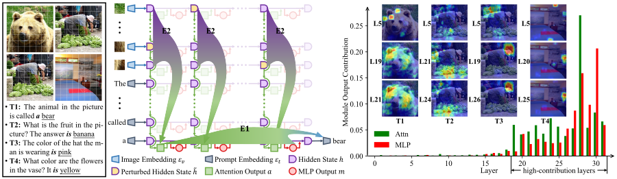
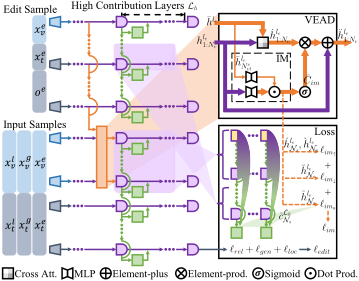

# VisEdit

<div style="display: flex; justify-content: space-between; align-items: center;">
  
  
</div>


Source code for **AAAI 2025 (Oral)** paper [*Attribution Analysis Meets Model Editing: Advancing Knowledge Correction in Vision Language Models with VisEdit*.](https://ojs.aaai.org/index.php/AAAI/article/view/32215)

# Setup
0. Python version: 3.11.9
1. Please download the E-EVQA and E-IC datasets from the URL provided in [1] and place the related folders in the `data` directory.
2. Please modify the `ROOT_PATH` in `utils/GLOBAL.py` to the absolute path of the current directory, and update `model_path_map` to the absolute paths of each backbone's weights.

# Module Contribution Attribution 
Please run `contribution_module.py`, using Jupyter Notebook would be better for display.

# Visual Representation Contribution Attribution 
Please run `contribution_visual_reps.py`, using Jupyter Notebook would be better for display.

# train VEAD
Please use the following script to train a VEAD:

`python vead_train.py -mn llava -dna EVQA -bs 4 -dvc "cuda:0" -edvc 1 `

# evaluate VEAD
Please use the following script to test VEAD:

`python vead_test.py -mn llava -dn EVQA -dvc "cuda:0" -ckpt [vead_checkpoint_path]`


# Citation
Please cite our paper if this work has inspired or assisted you :)
```bibtex
@inproceedings{DBLP:conf/aaai/Chen00HWL25,
  author       = {Qizhou Chen and
                  Taolin Zhang and
                  Chengyu Wang and
                  Xiaofeng He and
                  Dakan Wang and
                  Tingting Liu},
  editor       = {Toby Walsh and
                  Julie Shah and
                  Zico Kolter},
  title        = {Attribution Analysis Meets Model Editing: Advancing Knowledge Correction
                  in Vision Language Models with VisEdit},
  booktitle    = {AAAI-25, Sponsored by the Association for the Advancement of Artificial
                  Intelligence, February 25 - March 4, 2025, Philadelphia, PA, {USA}},
  pages        = {2168--2176},
  publisher    = {{AAAI} Press},
  year         = {2025},
  url          = {https://doi.org/10.1609/aaai.v39i2.32215},
  doi          = {10.1609/AAAI.V39I2.32215},
  timestamp    = {Thu, 17 Apr 2025 17:08:57 +0200},
  biburl       = {https://dblp.org/rec/conf/aaai/Chen00HWL25.bib},
  bibsource    = {dblp computer science bibliography, https://dblp.org}
}
```


# Reference
[1] Can We Edit Multimodal Large Language Models?


